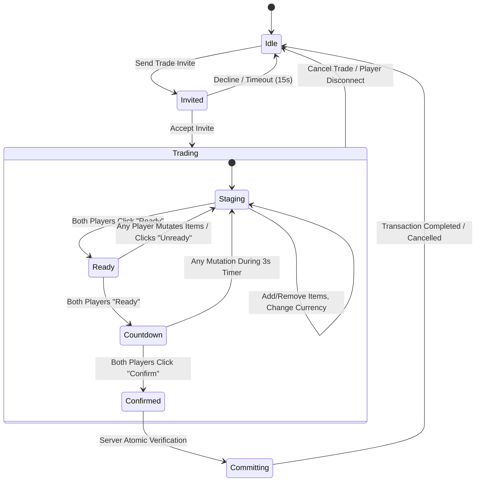

# Especificação Técnica do Sistema de Trocas (Trading System)

Este documento descreve a arquitetura de software, protocolo de rede, máquina de estados, regras de segurança anti-exploit e ciclo de vida da interface do sistema de trocas P2P (*Player-to-Player*) do jogo.

---

## 1. Visão Geral da Arquitetura

O sistema de trocas adota o padrão **Server-Authoritative com Máquina de Estados de Dupla Confirmação**. Nenhuma mutação de inventário ou transferência de moedas ocorre no cliente. O cliente atua exclusivamente como camada de renderização, entrada de dados e feedback audiovisual.

* **Servidor Central:** [TradingService.server.luau](file:///c:/Users/Reitora%2002/Desktop/RobloxProjects/Games/PS99/src_destruction/ServerScriptService/Scripts/Game/TradingService.server.luau)
* **Validação Econômica (RAP):** [RAP_Validator.luau](file:///c:/Users/Reitora%2002/Desktop/RobloxProjects/Games/PS99/src_destruction/ServerScriptService/Library/RAP_Validator.luau)
* **Sanitização de Rede:** [SanitizeInput.luau](file:///c:/Users/Reitora%2002/Desktop/RobloxProjects/Games/PS99/src_destruction/ServerScriptService/Library/SanitizeInput.luau)
* **Persistência e Session Locking:** [Saving.luau](file:///c:/Users/Reitora%2002/Desktop/RobloxProjects/Games/PS99/src_destruction/ServerScriptService/Library/Saving.luau)

---

## 2. Máquina de Estados e Protocolo de Troca

### 2.1 Fases da Negociação
1. **Fase de Convite (Invite):**
   - O jogador seleciona um usuário na `PlayerList`.
   - O servidor verifica se ambos estão no servidor, se nenhum está com trocas desativadas (`Settings.Trading == false`) e se nenhum já está em sessão ativa de troca.
   - O convite expira automaticamente em 15 segundos se não respondido.

2. **Fase de Oferta (Staging):**
   - Ambos os jogadores adicionam/removem itens (Skins, Contratos, Moedas).
   - Cada inserção ou remoção atualiza o estado em memória no servidor e transmite a sincronização para o outro jogador.
   - Itens trancados (`Locked == true`) ou equipados não podem ser colocados na troca.

3. **Fase de Prontidão (Ready):**
   - Quando ambos clicam em **Ready**, os botões mudam visualmente e o estado passa para verificação mútua.
   - **Gatilho de Invalidação:** Se **qualquer** jogador alterar uma moeda, adicionar ou remover uma skin enquanto estiver em *Ready*, ambos os jogadores são desmarcados automaticamente de volta para a fase *Staging*. Isso previne o exploit clássico de alteração de oferta de última hora (*Last-Second Switch Exploit*).

4. **Fase de Contagem e Confirmação (Countdown & Confirm):**
   - Uma contagem regressiva obrigatória de **3 segundos** é disparada antes de liberar o botão de confirmação final.
   - Ambos devem clicar em **Confirm** para autorizar a transação final.
   - Se um jogador estiver entregando itens valiosos e recebendo nada em troca, um aviso de segurança modal é exibido (*"Are you sure you want to give these items away for free?"*).

5. **Fase de Commit Atômico (Atomic Commit):**
   - O servidor trava a sessão de troca de ambos os jogadores.
   - Valida novamente a posse física de todos os itens oferecidos diretamente no perfil (`profile.Skins`, `profile.Currency`).
   - Realiza a transferência de forma atômica no DataStore com lock de sessão.

---

## 3. Segurança e Prevenção Anti-Exploit

| Vulnerabilidade / Exploit | Mitigação Arquitetural |
| :--- | :--- |
| **Duplicação de Itens (Item Dupe)** | O `TradingService` utiliza travas de sessão atômicas (`SessionLock`). A remoção do inventário do doador e a inserção no destinatário ocorrem no mesmo ciclo atômico do servidor. |
| **Troca Falsa de Itens (Last-Second Switch)** | Qualquer alteração de dados no buffer de troca cancela imediatamente o estado `Ready` e reseta o temporizador de 3 segundos para ambos. |
| **Spoofing de Quantidades e Moedas** | Entradas numéricas passam por `SanitizeInput.isPositiveInteger`. Valores negativos, decimais, strings formatadas ou `NaN` são rejeitados na borda da rede. |
| **Manipulação de Preço Médio (RAP Manipulation)** | O módulo `RAP_Validator` monitora o histórico de valor médio usando Média Móvel Exponencial (EMA), descartando outliers e transações desbalanceadas entre contas suspeitas. |
| **Desconexão Forçada (Combat / Trade Log)** | Se um jogador se desconectar durante qualquer fase da troca, a sessão é cancelada imediatamente e todos os itens permanecem em seus inventários de origem. |

---

## 4. Contratos de Rede (Remotes)

Todas as requisições utilizam `Network.FireServer` e são autoritariamente ouvidas por `TradingService.server.luau`:

| Evento / Função Remota | Tipo | Parâmetros | Descrição |
| :--- | :--- | :--- | :--- |
| `Send Trade Invite` | RemoteFunction | `targetPlayer: Player` | Inicia o convite de troca para o jogador alvo. |
| `Accept Trade Invite` | RemoteServerEvent | `inviterPlayer: Player` | Aceita o convite pendente e inicializa a sessão. |
| `Decline Trade Invite`| RemoteServerEvent | `inviterPlayer: Player` | Rejeita o convite de troca. |
| `Add Trade Item` | RemoteServerEvent | `itemData: table` | Adiciona um item (skin/moeda) ao buffer da troca. |
| `Remove Trade Item` | RemoteServerEvent | `itemUID: string` | Remove o item selecionado do buffer. |
| `Change Trade Currency`| RemoteServerEvent | `currencyType: string, amount: number` | Atualiza o montante de moedas ofertadas. |
| `Ready Trade` | RemoteServerEvent | *nenhum* | Marca o jogador como pronto na fase de oferta. |
| `Unready Trade` | RemoteServerEvent | *nenhum* | Desfaz a prontidão. |
| `Confirm Trade` | RemoteServerEvent | *nenhum* | Confirma a transação na etapa pós-countdown. |
| `Cancel Trade` | RemoteServerEvent | *nenhum* | Aborta a sessão imediatamente e fecha as janelas. |
| `Send Trade Message` | RemoteServerEvent | `message: string` | Envia mensagem no chat interno da troca. |

---

## 5. Mapeamento de Interface (UI/UX)

### 5.1 PlayerList (`Trade.Frame.PlayerList`)
* **Lista de Jogadores:** Exibe todos os jogadores no servidor com suporte a `ButtonFX` (efeito de escala suave ao passar o mouse e clicar).
* **Barra de Busca (`Search.Query`):** Filtro em tempo real por `Name` ou `DisplayName`.
* **Modo Amigos (`Bottom.Show.ToggleShow`):** Alterna a exibição entre "All" (todos os jogadores) e "Friends" (apenas conexões de amizade do Roblox).
* **Histórico de Trocas (`Bottom.History.ToggleHistory`):** Abre a interface de histórico com os últimos registros de trocas concluídas.

### 5.2 Janela de Negociação (`Trade.Frame.Trade`)
* **Slots de Itens (`Client.Pets` / `Skins`):** Efeito de respiração suave na transparência do ícone usando função senoidal (`math.sin`) sincronizada com o `RenderStepped`. Fundo verde brilhante quando posicionado na troca.
* **Inputs de Moedas (`Diamonds` / `Coins` / `PawTokens`):** Campo com formatação automática de milhares e animação de piscar em branco (*flash feedback*) com som `rbxassetid://4586418198` quando atualizado com sucesso.
* **Botão Dinâmico de Ação (`Buttons.Ready` / `Confirm`):**
  * Estado Inicial: `Ready!` (Verde)
  * Aguardando Parceiro: `Waiting...`
  * Contagem: `(3)`, `(2)`, `(1)`
  * Confirmação Final: `Confirm!`
* **Chat Integrado (`ChatOverlay`):** Janela deslizante de chat de texto restrita à sessão de troca com contador de mensagens não lidas no botão de acionamento.
